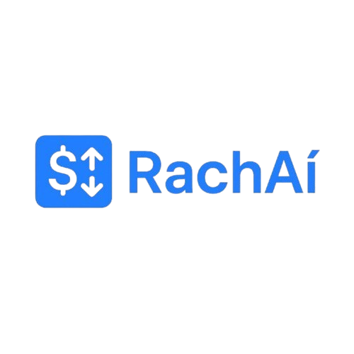
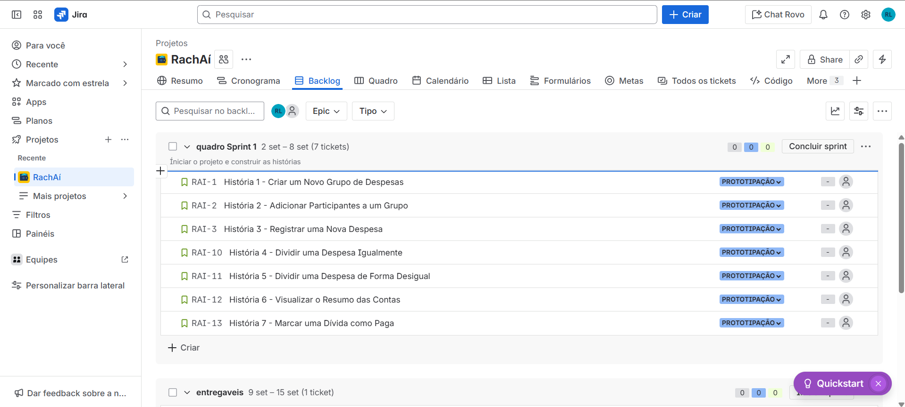
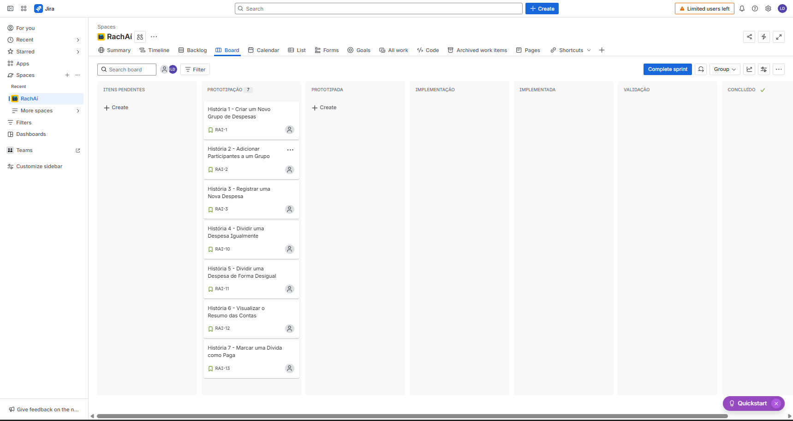
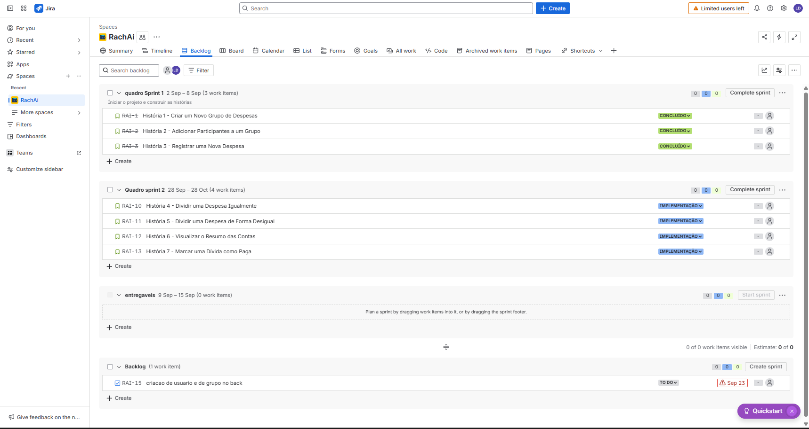
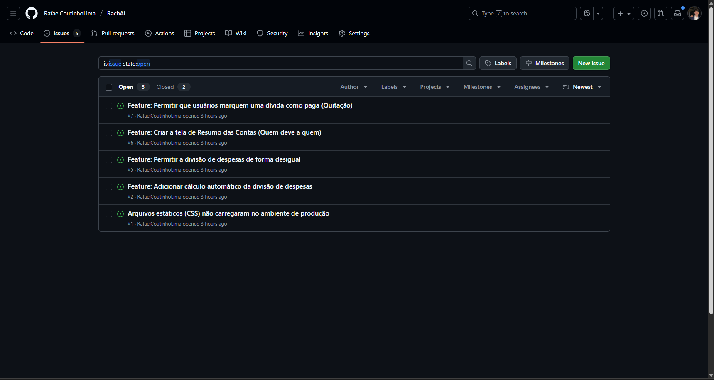
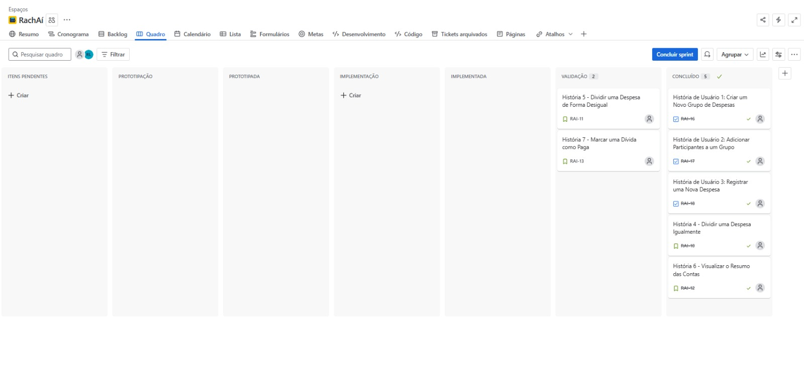
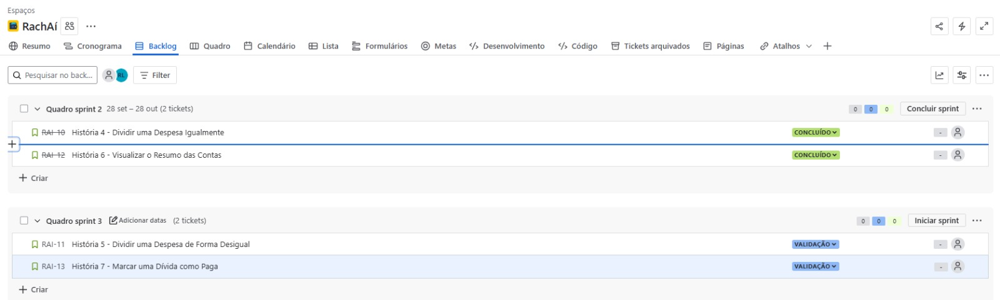
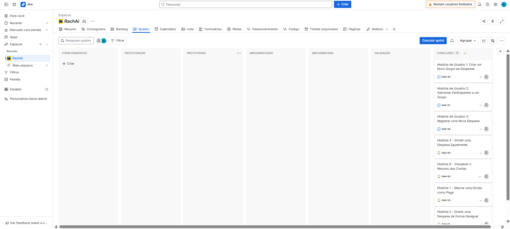
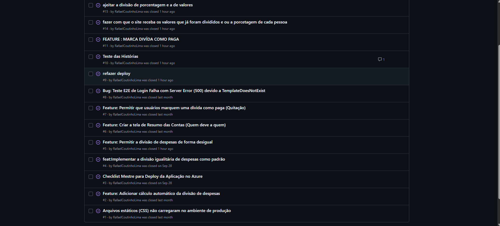

  

# Projeto RachAi

RachAi é um aplicativo desenvolvido para simplificar a divisão de despesas entre amigos, seja em viagens, contas de bar, ou qualquer outra ocasião. Este projeto documenta o processo de planejamento e prototipação da solução.

## Ferramentas

- **Prototipação**: Figma - Utilizado para criar e validar protótipos de design da interface do usuário.
- **Gestão de Projetos**: Jira - Ferramenta para o planejamento e acompanhamento das tarefas do projeto, utilizando a metodologia Scrum.

<h2>Links</h2>

- [Histórias de Usuário](https://docs.google.com/document/d/1YHw_6g5my2Kra5os0ZGiJ8zZ1qnXhpiZcFE_YLekO64/edit?usp=sharing)
- [Protótipo de Baixa Fidelidade (Figma)](https://www.figma.com/design/iWuUijDxGKfmdeoyyv9INg/RachA%C3%AD-Lo-fi?node-id=106-3&p=f&t=bBpdtPYtQnRTNjag-0)
- [Link para o JIRA (gestão do projeto)](https://jeaateam.atlassian.net/jira/software/projects/RAI/boards/34)
- [Screencast de Apresentação do Protótipo (Figma)](https://youtu.be/dA_j2NWCX2k)
- [Screencast do site funcional](https://youtu.be/n-TJ8coBneE)
- [Screencast de Testes Automatizados (Entrega 3)](https://youtu.be/8Kbwe1w_Krs)
- [Screencast das Novas Histórias de Usuário (Entrega 3)](https://www.youtube.com/watch?v=a_YfVmuAzR4)
- [Link para o Teste CI/CD (Entrega 3)](https://youtu.be/Fv5gN8yQNqw)
- [Link para o Teste CI/CD (Entrega 4)](LINK_AQUI)
- [Documentação de Contribuição (CONTRIBUTING.md)](CONTRIBUTING.md)

<h2>Primeira Entrega - Planejamento e Protótipo</h2>

### 1. Histórias de Usuário
As histórias de usuário foram documentadas detalhadamente, incluindo critérios de aceite e cenários de validação no formato BDD.

- [➡️ Acesse o documento com as Histórias de Usuário aqui](https://docs.google.com/document/d/1YHw_6g5my2Kra5os0ZGiJ8zZ1qnXhpiZcFE_YLekO64/edit?usp=sharing)

### 2. Gerenciamento Ágil (JIRA)
O projeto está sendo gerenciado utilizando a metodologia Scrum.

**Backlog do Produto:**

**Quadro da Sprint 1:**

### 3. Protótipo de Baixa Fidelidade (Figma)
Foi desenvolvido um protótipo de baixa fidelidade para visualizar os fluxos de navegação.

- [➡️ Acesse o protótipo no Figma aqui](https://www.figma.com/design/iWuUijDxGKfmdeoyyv9INg/RachA%C3%AD-Lo-fi?node-id=106-3&p=f&t=bBpdtPYtQnRTNjag-0)

<h2>Segunda Entrega</h2>

- **Site em Produção:** [https://rachaiapp.azurewebsites.net/](https://rachaiapp.azurewebsites.net/) - *Login: [usuário] || Senha: [senha]*

- **Screencast:** [🎥 Assista ao screencast do site funcional no YouTube aqui](https://youtu.be/n-TJ8coBneE)

- **Quadro da Sprint 2 (Jira):**
  *Backlog Sprint 2:*
  
  *Quadro da Sprint 2:*
  

- **Bug Tracker:**
  

- **Colaboração na Prática: Nosso Desenvolvimento em Par:**
  Nesta entrega, nossa grande aposta foi na programação em par.É essa abordagem que fez toda a diferença. Trabalhando lado a lado, conseguimos discutir ideias em tempo real, revisar o código no momento em que era escrito e encontrar soluções mais criativas para os desafios. O resultado não foi apenas um código mais limpo e com menos bugs, mas também um time mais integrado e um aprendizado muito maior para todos.
  
  As duplas foram organizadas da seguinte forma:
  * **Rafael Coutinho Lima** e **Guilherme Tolentino Leitão de Melo**
  * **João Eduardo Azevedo de Andrade** e **Lucca Albuquerque D'Angelo**
  * **Marcelo Asfora de Menezes** e **Pedro Coutinho da Silva**

<h2>Terceira Entrega</h2>

### Gerenciamento Ágil (JIRA)
O projeto continua sendo gerenciadoD utilizando a metodologia Scrum.

**Quadro da Sprint 3:**

**Quadro do BackLog 3:**

**Bug Tracker (Sprint 3):**

### Screencasts
- **Testes Automatizados:** [🎥 Assista ao screencast dos testes automatizados aqui](https://youtu.be/8Kbwe1w_Krs)
- **Novas Histórias de Usuário:** [🎥 Assista ao screencast das novas funcionalidades aqui](https://www.youtube.com/watch?v=a_YfVmuAzR4)

### Teste CI/CD
- [➡️ Acesse o link para o Teste CI/CD aqui](https://youtu.be/Fv5gN8yQNqw)

### Colaboração em Par:
Programação em Par (atualização-Entrega 3):Na Sprint 3, nós permanecemos no "pair programming" e isso já tinha virado rotina. Ficou natural adolescente entrar no Discord, compartilhar a tela e começar a implementação das histórias.
Essa dinâmica tornou η caça aos bugs muito mais eficiente e o desenvolvimento das novas *features*, como os testes automatizados. A troca constante de conhecimento, aprendemos juntos, corrigimos juntos.

<h2>Quarta Entrega</h2>

### Gerenciamento Ágil (JIRA)
**Quadro da Sprint 4:**

### Uso do Issue/bug tracker (no GitHub)
**Bug Tracker (Sprint 4):**

### Screencasts e Deployment
- **Deployment das Novas Histórias:** [🎥 Screencast das Novas Funcionalidades (Entrega 4)](LINK_YOUTUBE_AQUI)
- **Testes de Sistema (E2E) Automatizados:** [🎥 Screencast dos Testes Automatizados (Entrega 4)](LINK_YOUTUBE_AQUI)

### CI/CD com Build e Deployment Automatizado
Pipeline alterada com adição dos testes automatizados.
- **Screencast do Processo de Build/Deployment:** [🎥 Assista ao screencast do processo de CI/CD aqui](LINK_YOUTUBE_AQUI)

### Colaboração em Par (Atualização)
*Programação em Par (atualização-Entrega 4): Com o avanço do projeto, a programação em par foi se tornando uma prática cada vez mais natural para nós, principalmente nos momentos em que surgiam dúvidas ou problemas mais difíceis. Nessas horas, trabalhar em dupla acelerava a busca por soluções e deixava o processo menos estressante. Ao mesmo tempo, aprendemos a equilibrar: quando a tarefa exigia mais concentração, cada um seguia sozinho. Esse equilíbrio entre colaboração e autonomia fez diferença tanto na qualidade do código quanto no entrosamento do grupo. No final, sentimos que a programação em par não só ajudou a superar desafios técnicos, mas também fortaleceu a confiança entre os membros da equipe.*

### Documentação (CONTRIBUTING.md)
Documentação clara e objetiva conduzindo qualquer pessoa a montar o ambiente corretamente e contribuir com o projeto.
- [➡️ Acesse o CONTRIBUTING.md aqui](CONTRIBUTING.md)

## Equipe

- [João Eduardo Azevedo de Andrade] - jeaa@cesar.school
- [Lucca Albuquerque D'Angelo]- lada@cesar.school
- [Marcelo Asfora de Menezes] - mam@cesar.school
- [Pedro Coutinho da Silva]- pcs4@cesar.school
- [Rafael Coutinho Lima] - rcl4@cesar.school
- [Guilherme Tolentino Leitão de Melo] - gtlm@cesar.school
