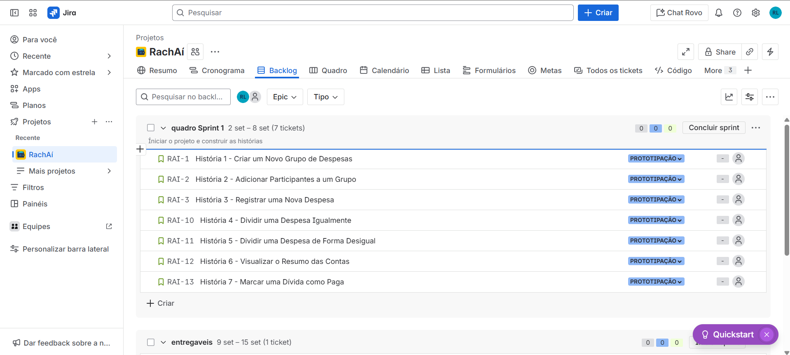
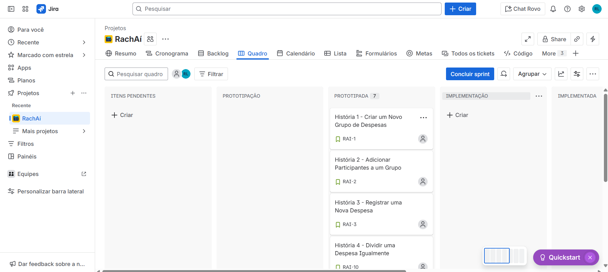

  

# Projeto RachAi

RachAi é um aplicativo desenvolvido para simplificar a divisão de despesas entre amigos, seja em viagens, contas de bar, ou qualquer outra ocasião. Este projeto documenta o processo de planejamento e prototipação da solução.

## Ferramentas

- **Prototipação**: Figma - Utilizado para criar e validar protótipos de design da interface do usuário.
- **Gestão de Projetos**: Jira - Ferramenta para o planejamento e acompanhamento das tarefas do projeto, utilizando a metodologia Scrum.

<h2>Links</h2>

- [Histórias de Usuário](https://docs.google.com/document/d/1YHw_6g5my2Kra5os0ZGiJ8zZ1qnXhpiZcFE_YLekO64/edit?usp=sharing)
- [Protótipo de Baixa Fidelidade (Figma)](https://www.figma.com/design/iWuUijDxGKfmdeoyyv9INg/RachA%C3%AD-Lo-fi?node-id=106-3&p=f&t=bBpdtPYtQnRTNjag-0)
- [Screencast de Apresentação do Protótipo (Figma)](https://youtu.be/dA_j2NWCX2k)
- [Screencast do site funcional](https://youtu.be/n-TJ8coBneE)

<h2>Entregas do Projeto</h2>

### 1. Histórias de Usuário

As histórias de usuário foram documentadas detalhadamente, incluindo critérios de aceite e cenários de validação no formato BDD. Elas guiam o desenvolvimento das funcionalidades centrais do aplicativo.

- [➡️ Acesse o documento com as Histórias de Usuário aqui](https://docs.google.com/document/d/1YHw_6g5my2Kra5os0ZGiJ8zZ1qnXhpiZcFE_YLekO64/edit?usp=sharing)

### 2. Gerenciamento Ágil (JIRA)

O projeto está sendo gerenciado utilizando a metodologia Scrum. Abaixo estão os artefatos visuais do backlog do produto e do quadro da sprint atual.

**Backlog do Produto:**

**Quadro da Sprint 1:**

### 3. Protótipo de Baixa Fidelidade (Figma)

Foi desenvolvido um protótipo de baixa fidelidade para visualizar os fluxos de navegação principais do aplicativo/site. O protótipo foca na usabilidade e na estrutura das telas.

- [➡️ Acesse o protótipo no Figma aqui](https://www.figma.com/design/iWuUijDxGKfmdeoyyv9INg/RachA%C3%AD-Lo-fi?node-id=106-3&p=f&t=bBpdtPYtQnRTNjag-0)

### 4. Screencast de Apresentação do Protótipo

Um screencast foi gravado para demonstrar a navegação e as funcionalidades presentes no protótipo de baixa fidelidade.

- [🎥 Assista ao screencast no YouTube aqui](https://youtu.be/dA_j2NWCX2k)
- [🎥 Assista ao screencast do site funcional no YouTube aqui](https://youtu.be/n-TJ8coBneE)

## Equipe

- [Nome do Membro 1](Link do GitHub) - email@cesar.school
- [Nome do Membro 2](Link do GitHub) - email@cesar.school
- [Nome do Membro 3](Link do GitHub) - email@cesar.school
- [Nome do Membro 4](Link do GitHub) - email@cesar.school
