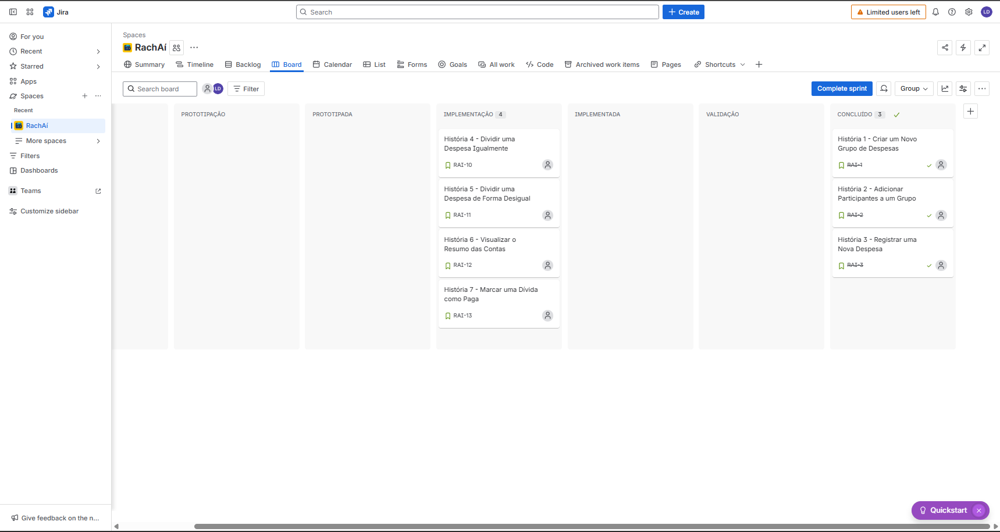

  

# Projeto RachAi

RachAi é um aplicativo desenvolvido para simplificar a divisão de despesas entre amigos, seja em viagens, contas de bar, ou qualquer outra ocasião. Este projeto documenta o processo de planejamento e prototipação da solução.

## Ferramentas

- **Prototipação**: Figma - Utilizado para criar e validar protótipos de design da interface do usuário.
- **Gestão de Projetos**: Jira - Ferramenta para o planejamento e acompanhamento das tarefas do projeto, utilizando a metodologia Scrum.

<h2>Links</h2>

- [Histórias de Usuário](https://docs.google.com/document/d/1YHw_6g5my2Kra5os0ZGiJ8zZ1qnXhpiZcFE_YLekO64/edit?usp=sharing)
- [Protótipo de Baixa Fidelidade (Figma)](https://www.figma.com/design/iWuUijDxGKfmdeoyyv9INg/RachA%C3%AD-Lo-fi?node-id=106-3&p=f&t=bBpdtPYtQnRTNjag-0)
- [Link para o JIRA (gestão do projeto)](https://jeaateam.atlassian.net/jira/software/projects/RAI/boards/34)
- [Screencast de Apresentação do Protótipo (Figma)](https://youtu.be/dA_j2NWCX2k)
- [Screencast do site funcional](https://youtu.be/n-TJ8coBneE)
- [Screencast de Testes Automatizados (Entrega 3)](INSIRA_O_LINK_AQUI)
- [Screencast das Novas Histórias de Usuário (Entrega 3)](INSIRA_O_LINK_AQUI)

<h2>Primeira Entrega - Planejamento e Protótipo</h2>

### 1. Histórias de Usuário
As histórias de usuário foram documentadas detalhadamente, incluindo critérios de aceite e cenários de validação no formato BDD.

- [➡️ Acesse o documento com as Histórias de Usuário aqui](https://docs.google.com/document/d/1YHw_6g5my2Kra5os0ZGiJ8zZ1qnXhpiZcFE_YLekO64/edit?usp=sharing)

### 2. Gerenciamento Ágil (JIRA)
O projeto está sendo gerenciado utilizando a metodologia Scrum.

**Backlog do Produto:**

**Quadro da Sprint 1:**

### 3. Protótipo de Baixa Fidelidade (Figma)
Foi desenvolvido um protótipo de baixa fidelidade para visualizar os fluxos de navegação.

- [➡️ Acesse o protótipo no Figma aqui](https://www.figma.com/design/iWuUijDxGKfmdeoyyv9INg/RachA%C3%AD-Lo-fi?node-id=106-3&p=f&t=bBpdtPYtQnRTNjag-0)

<h2>Segunda Entrega</h2>

- **Site em Produção:** [https://rachaiapp.azurewebsites.net/](https://rachaiapp.azurewebsites.net/) - *Login: [usuário] || Senha: [senha]*

- **Screencast:** [🎥 Assista ao screencast do site funcional no YouTube aqui](https://youtu.be/n-TJ8coBneE)

- **Quadro da Sprint 2 (Jira):**
   *Backlog Sprint 2:*
 
   *Quadro da Sprint 2:*
 

- **Bug Tracker:**
 

- **Colaboração na Prática: Nosso Desenvolvimento em Par:**
   Nesta entrega, nossa grande aposta foi na programação em par. Acreditamos que "duas cabeças pensam melhor que uma", e essa abordagem fez toda a diferença. Trabalhando lado a lado, conseguimos discutir ideias em tempo real, revisar o código no momento em que era escrito e encontrar soluções mais criativas para os desafios. O resultado não foi apenas um código mais limpo e com menos bugs, mas também um time mais integrado e um aprendizado muito maior para todos.
  
   As duplas foram organizadas da seguinte forma:
   * **Rafael Coutinho Lima** e **Guilherme Tolentino Leitão de Melo**
   * **João Eduardo Azevedo de Andrade** e **Lucca Albuquerque D'Angelo**
   * **Marcelo Asfora de Menezes** e **Pedro Coutinho da Silva**

<h2>Terceira Entrega</h2>

### Gerenciamento Ágil (JIRA)
O projeto continua sendo gerenciado utilizando a metodologia Scrum.

**Quadro da Sprint 3:**

**Quadro do BackLog 3:**

### Screencasts
- **Testes Automatizados:** [🎥 Assista ao screencast dos testes automatizados aqui](INSIRA_O_LINK_AQUI)
- **Novas Histórias de Usuário:** [🎥 Assista ao screencast das novas funcionalidades aqui](INSIRA_O_LINK_AQUI)

## Equipe

- [João Eduardo Azevedo de Andrade] - jeaa@cesar.school
- [Lucca Albuquerque D'Angelo]- lada@cesar.school
- [Marcelo Asfora de Menezes] - mam@cesar.school
- [Pedro Coutinho da Silva]- pcs4@cesar.school
- [Rafael Coutinho Lima] - rcl4@cesar.school
- [Guilherme Tolentino Leitão de Melo] - gtlm@cesar.school
